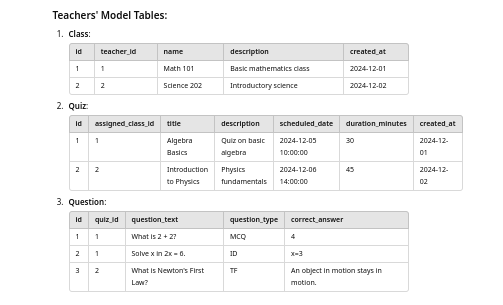
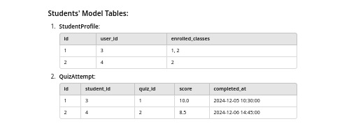

# Quiz Application
#### (one to many) class > quiz
#### example if nag create ng quiz1 na naka connect sa Math101 Class.. dun lang sya mag eexist kapag dinisplay, wala sa Science101. Then ang makakakita lang yung mga students na nakapasok sa Math101 Class 

## Class
- Represents a group of students with a name.
- Has many students and one teacher.

## Quiz
- A test linked to a specific class.
- Has a title, optional description, date, and duration.

## Question
- Belongs to a quiz and has a text and a type (MCQ, True/False, or Identification).
- Includes the correct answer for checking.

## Relationships
- Teachers manage classes with students.
- Classes have multiple quizzes, and quizzes have multiple questions.

---

## Teachers Model

## Students Model

